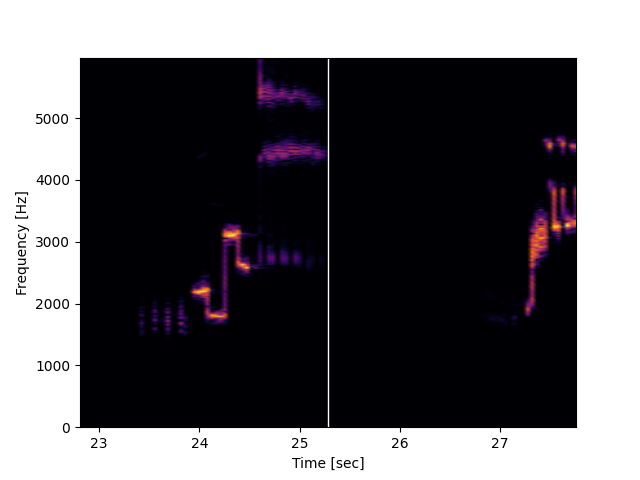

# Generate video spectrograms from audio files




## Install from github


```bash
pip install git+https://github.com/nicolasloizeau/video-spectrogram.git#egg=video-spectrogram
```

## Usage

Help
```bash
video-spectrogram --help
```
Example:
Convert `audio.mp3` to a video spectrogram with a maximum frequency of 2000 Hz and a frame rate of 30 fps, and use matplotlib for rendering:
```bash
video-spectrogram audio.mp3 --maxfreq 2000 --fps 30 -plt
```
